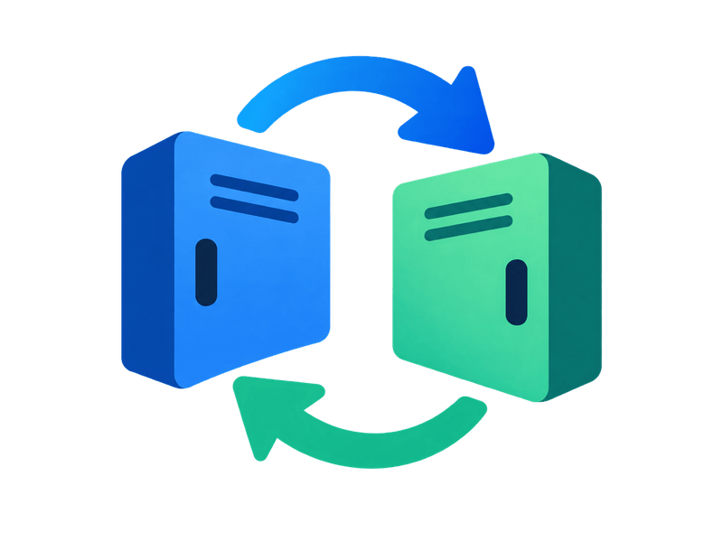
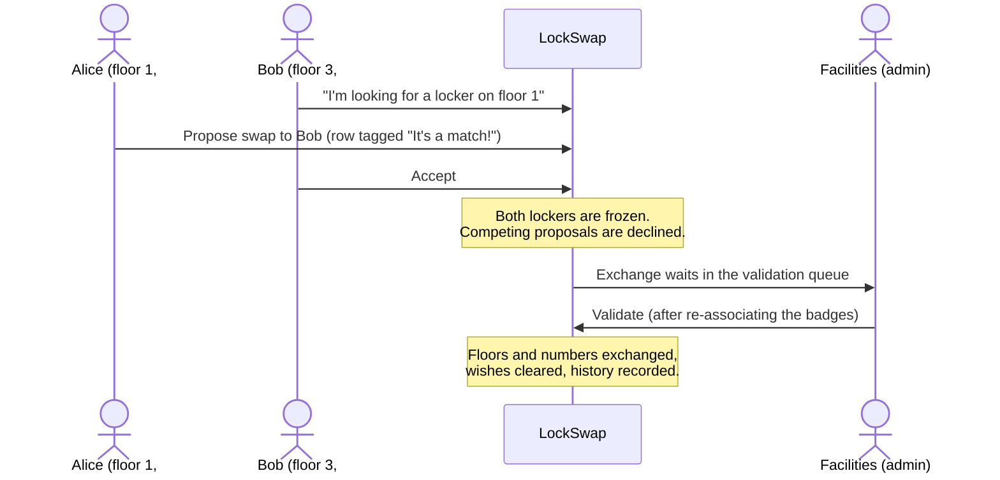

<p align="center">
  
</p>

<h1 align="center">LockSwap</h1>

<p align="center"><strong>Swap lockers with your colleagues — and let facilities validate it.</strong></p>

<p align="center">
  <a href="https://github.com/saumon/lockswap/actions/workflows/ci.yml"></a>
  
  
  
  
  <a href=".rubocop.yml"></a>
  <a href="LICENSE"></a>
</p>

<p align="center">
  <a href="https://saumon.github.io/lockswap/">Website</a> ·
  <a href="#quick-start">Quick start</a> ·
  <a href="#features">Features</a> ·
  <a href="#how-a-swap-works">How a swap works</a> ·
  <a href="docs/deployment.md">Deploy</a> ·
  <a href="docs/features.md">Feature history</a> ·
  <a href="docs/development.md">Dev guide</a> ·
  <a href="CONTRIBUTING.md">Contributing</a>
</p>

<!--
  TODO — the single most valuable addition to this page: a screenshot or a short
  GIF of the swap flow (locker wishes list with the "It's a match!" tag), placed
  here, 1200px wide. Capture it with the throwaway system test described in
  CLAUDE.md ("How to check the work"); save it to docs/images/.
-->

## What is LockSwap?

In most companies, lockers are assigned once and never move. Changing one means
an e-mail to facilities, a spreadsheet, and a wait.

**LockSwap lets employees find each other and agree a swap directly**; an
administrator then validates it once the badges have been re-associated. The
application keeps every assignment up to date and keeps the history of every
change.

> One locker, one holder. A given number on a given floor can never belong to two people.

## Features

**For employees**
- Record your floor and locker number — or say you have none.
- Declare which floor you are looking for, and browse everyone else's wishes.
- **"It's a match!"** — the list tags the one swap guaranteed to work both ways.
- Propose, accept, decline or withdraw a swap; accepting one automatically
  declines every competing proposal.
- Your locker is **held still** while a swap is outstanding, so nobody changes
  the terms halfway through.
- Full proposal history, recorded as it happened.

**For administrators**
- Directory of every account with floor, locker and wish, filterable.
- **Validation queue**: approve or refuse (with a reason) accepted exchanges.
- Grant admin rights; activate an account by hand.
- **Danger Zone** (super admin): allowed e-mail domains, site language,
  the building's floor list, the locker-number format.
- **Locker Map**: draw zones floor by floor; every screen then shows where a
  locker physically is.

**Under the hood**
- Sign-up with e-mail activation, password reset, e-mail change confirmation,
  password change from the account page (signs out every other device),
  account lockout (5 failures → 15 minutes).
- English and French, switched site-wide; a test fails if a key is untranslated.
- Responsive from 320px up; accessibility (axe-core) audited on every screen in CI.
- Server-rendered Rails + Hotwire. **No Node, no bundler, no external services**
  — SQLite, Solid Queue, Solid Cache, self-hosted fonts.

## How a swap works



## Quick start

**Requirements:** Ruby 3.4.6 (see `.ruby-version`), SQLite 3.8+, libvips.
Google Chrome only if you run the system tests.

```sh
git clone git@github.com:saumon/lockswap.git
cd lockswap
bin/setup          # bundle install, db:prepare (seeds in development), then starts the server
```

Open <http://localhost:3000> and sign up at `/users/sign_up`. **The first account
to register becomes the super admin.**

New accounts must be activated from an e-mailed link. In development no SMTP
server is needed: the mail is waiting in the built-in inbox at
<http://localhost:3000/letter_opener>.

The development seeds give you a realistic building: French UI, floors
`RdC, 1–5`, a 3-digit locker format and 18 zones holding 720 lockers.

<details>
<summary>Other ways to run it</summary>

```sh
bin/dev                 # Puma + Tailwind watcher
bin/rails server        # server only — run bin/rails tailwindcss:build first
bin/rails db:seed       # re-run the (idempotent) development seeds
```
</details>

## Configuration

| Variable | Used for | Default |
| --- | --- | --- |
| `APP_HOST`, `APP_PROTOCOL` | links in e-mails | — |
| `SMTP_ENABLED`, `SMTP_ADDRESS`, `SMTP_PORT`, `SMTP_USERNAME`, `SMTP_PASSWORD`, `SMTP_SENDER` … | outgoing mail | letter_opener (dev) |
| `RAILS_MASTER_KEY` | production credentials | — |

Put them in `.env` (read by `bin/dev`, never committed). Production **must** be
able to send mail, or nobody new can join — see [docs/email.md](docs/email.md).

## Roles

| Role | Who | Can |
| --- | --- | --- |
| **Standard** | everyone | manage own locker and wish, send/answer proposals |
| **Admin** | granted by another admin | + user directory, swap validation, Locker Map |
| **Super admin** | the first account ever registered — always exactly one | + Danger Zone |

Details: [docs/roles.md](docs/roles.md).

## Tech stack

Ruby 3.4 · Rails 8.1 · Devise · SQLite · Solid Queue / Cache / Cable ·
Hotwire (Turbo + Stimulus, importmap) · Tailwind CSS 4 · Propshaft ·
Minitest + Capybara + axe-core · RuboCop · Brakeman · Docker + Kamal.

## Development

```sh
bin/rails test          # models, controllers, views, i18n completeness, breakpoint rule
bin/rails test:system   # end-to-end flows + accessibility + responsive sweeps (needs Chrome)
bin/ci                  # everything CI runs: rubocop, audits, brakeman, tests
```

More in the [development guide](docs/development.md): localization rules, the accessibility audit, and how to validate a feature by hand.

The system tests serve the **compiled** stylesheet — run
`bin/rails tailwindcss:build` before running a single system test file directly.

Design is a written contract, not a mood: read [`CLAUDE.md`](CLAUDE.md) before
touching the UI (the swap axis, palette, typography, motion budget).

### Spec-driven development

Every behavioural change goes through [Spec Kit](https://github.com/github/spec-kit)
(`specify → clarify → plan → tasks → analyze → implement`); artifacts live in
[`specs/`](specs/) and the project's rules in
[`.specify/memory/constitution.md`](.specify/memory/constitution.md).
The complete, feature-by-feature history (001 → 034) is in
[docs/features.md](docs/features.md).

## Deployment

Docker + [Kamal](https://kamal-deploy.org), to your own server over SSH.

```sh
kamal setup     # first time
kamal deploy    # afterwards
```

Placeholders to replace first, mail, persistent storage and troubleshooting:
[docs/deployment.md](docs/deployment.md).

## Roadmap

- [ ] Locker directory and availability (not yet specified)
- [ ] Beyond lockers: desks, parking spots, any shared individual resource

## Contributing

Issues and pull requests are welcome — see [CONTRIBUTING.md](CONTRIBUTING.md).
Security issues: please do not open a public issue; see [SECURITY.md](SECURITY.md).

## License

LockSwap is **source-available**, not open source: the code is public and free to
read, run, study and modify for **noncommercial purposes** — personal use,
research, education, charities, public institutions — under the
[PolyForm Noncommercial License 1.0.0](LICENSE).

**Any commercial use** (including running it for a company's employees, or
offering it as a service) requires a separate licence: contact
Grégoire BAUDRIMONT, <shrekrobu@gmail.com>.

---

<p align="center"><strong>LockSwap — Swap your locker, not your day.</strong></p>
